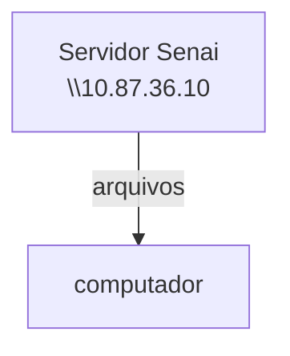

## Configurações do servidor educacional
simular um ambiente real de simulação

---
**objetivos**:
- Experiencia real de mercado;
- Administração de recursos;
- Experiencia em servidores Linux

## Servidor de Arquivos
Servidor educacional de arquivos, assim nâo dependendo da rede externa.


---
Cada aluno recebe o seu proprio acesso
cada máquina, possui um endereço de ip diferente

ip do meu servidor: 192.168.26

## SSERVIDOR
|Recurso|configuração|
|-------|------------|
|CPU|2 Cores|
|Ram| 512 MB |
|Disco| 6 GB |
|SISTEMA OPERACIONAL| Ubunto 26.04 LTS|
|acesso|ssh (Secure Shell)|
|IP DO CONTAINER|192.168.10.26|
|Usuario|Root|
|Senha Inicial|aluno01

## Comando para ver o uso de recursos

```bash
htop
```

## Comando de senha

```bash
passwd
```

---

## Banco de Dados
- dados: informaçãoes isoladas que não dizem muita coisa. Kauam, css, futebol

- conhecimento: oque podemos extrair á partir das informações 


---

```mermaid
graph TD
A[Guardar dados] --> B[Banco de dados]
A[Guardar dados] --> C [Arquivos/Planilhas]
B-->B1[Varios usuarios ao mesmo tempo]
B-->B2[Beckup e sincronisação]
B-->B3[consultas otimizadas e rápiudas]
C-->C1[Um arquivo por vez]
C-->C2[Backup ineficiente]
```

---

# SGBD
### Sistema Gerenciador de dados

Postgreles ( open surce)
MySql (MIcrosoft)
oracule DB (Oracule)
SQLLite (open surce)

>POSTGRESSQL: SBGD

primeiro atualizamosos pacotes:
```mermaid
sudo apt upgrade && update
```
para a instalação do Postgresql
```bash
sudo apt install -y  postgresql
```
## Aula 02
para verificar o status e demais informações do banco de dados, utilizamos o comando

```bash
pg_lscluster
```


para o 1º acesso, devemos colocar o seguinte comando:

```bash
 sudo -u postgres psql
```


para voltar para o usuario  devemos colocar:
```bash
\q
```


para acesso, via root, sem senha (SOCKET LOCAL ) utilisamos  o comando
```bash
sudo -u postgres psql
```

>com esse comando, não preciso mostrar quem o meu usuario é, o Linux faz a autenticação

Para alteração de senha do usuario Postgres, usamos o comando:

```sql
ALTER USER postgres PASSWORD '123'

