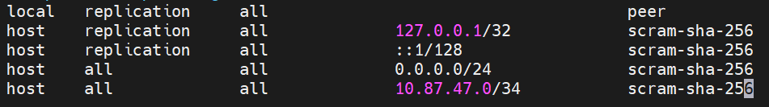

para a instalação do Postgresql
```bash
sudo apt install -y  postgresql
```
## Aula 02
para verificar o status e demais informações do banco de dados, utilizamos o comando

```bash
pg_lscluster
```


para o 1º acesso, devemos colocar o seguinte comando:

```bash
 sudo -u postgres psql
```


para voltar para o usuario  devemos colocar:
```bash
\q
```


para acesso, via root, sem senha (SOCKET LOCAL ) utilisamos  o comando
```bash
sudo -u postgres psql
```

>com esse comando, não preciso mostrar quem o meu usuario é, o Linux faz a autenticação

Para alteração de senha do usuario Postgres, usamos o comando:

```sql
ALTER USER postgres PASSWORD '123'
```

Apos a auteração da senha, o acesso, via localhost (Socket externo), é feitp atraves do comando:

```bash
sudo psql -h 127.0.0.1 -U postgres
```

> O " 127.0.0.1 " é o ip do local host

para faxer o server conseguir ouvir os outros computadosres, temos que fazer a seguinte sequencia de comando

configurações iniciais do POSTGRES:
- Para habilitar conexõese externas, de outros IPs, foi necessario as seguintes etapas
1. Navegar até a pasta do POSTGRESSQL (`/etc/postgres/18/main/`)

2. editar o arquivo `postgresql.conf` atraves do comando:

```bash
sudo nano postgresql.conf
```
3.Editar a linha listen_adresses = '*';

4. Editar a o arquivo pg_hba_config

5. Nas ultimas, linha adicionamos as seguintes cnfigurações:

`host all all 0.0.0.0/24 scram-sha-256`
`host all all 10.87.47.0/24 sram-sha-256`


**Criação do primeiro banco de dados**


para criar um Banco de dados, utilizamos o comando:

```sql
CREATE DATABASE
```

Para verificar os bancos existentes:
```sql
\l
```