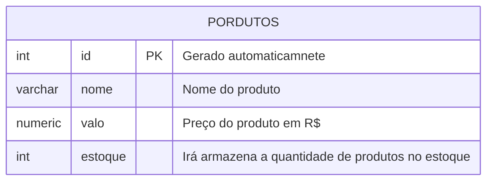
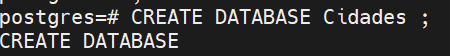
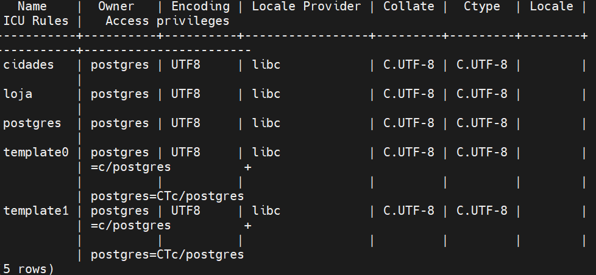
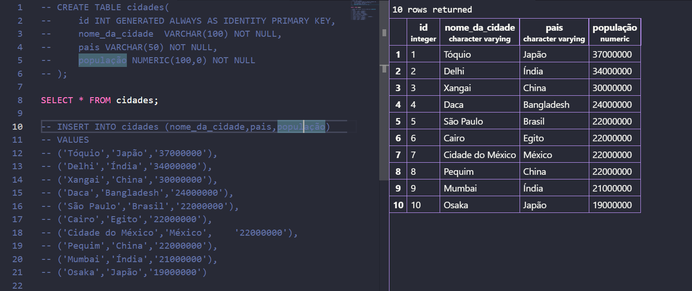
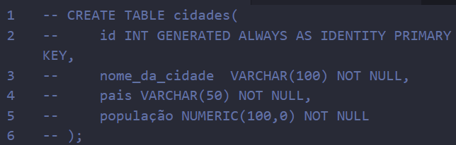
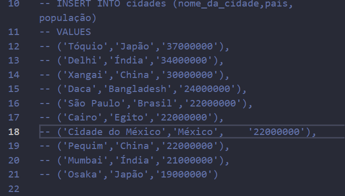
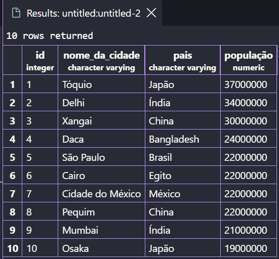

##
Para apagar um banco de dados, utilizamos o comando

```sql
DROP DATABASE cidade;
```

> não esquecer do ;

---

**Modelagem do banco de dados**



após modelar, iremos executar as etapas de criação e inserção de dados.
---
para criar a primeira tabela, usamos os comandos:
```sql
CREATE TABLE produtos(
    id INT GENERATED ALWAYS AS IDENTITY PRIMARY KEY, 
    nome VARCHAR(100) NOT NULL,
    valor NUMERIC(10,2) NOT NULL,
    estoque INT NOT NULL 0
);
```
---
Para consultar todos os itens da tabela, uso o comando
```sql
SELECT * FROM produtos;
```

---
para inserir dados na tabela, usamos:

```sql
INSERT INTO produtos(nome,valor,estoque)
VALUES('Caneta', '1.50','100');
```
---
**Crição do banco cidades**




>foi criado o banco cidades 


**No vscode**
>visão geral do codigo


>essa parte é a criação da tabela e oque vaui ter nela


>essa parte serve para pegar a tabela que acabamos de criar


>aqui é as informações que serão inseridas na tabela


>aqui é a tabela já com as informações
